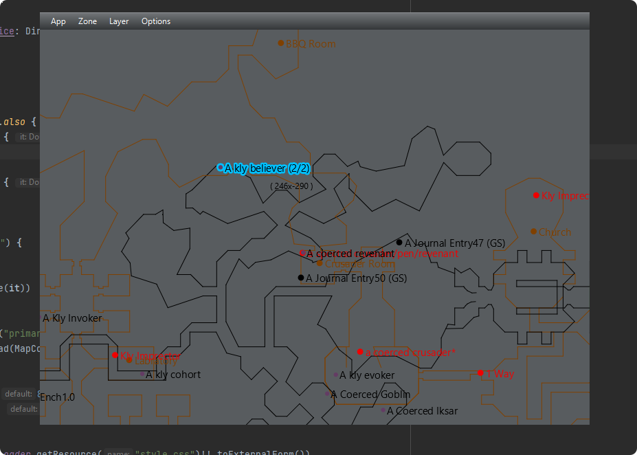

# JavaFX based map for [p1999-Everquest](https://www.project1999.com/)

### Installation

- install [Java](https://openjdk.org/) 
- download current [version](https://github.com/mknblch/kasimaps/tree/develop/dist/snapshot)
- unpack it and make the directory writable by the program!
- ~~adapt **eq_directory** in `application.properties` (unix style path's using slashes instead of backslashes!)~~
- run using `java -jar Kasimaps.jar` or `start.bat` on windows 
- a directory chooser should open 
 
### Features

- the program monitors Everquests `/log` directory and reacts to `/location` commands or zone-change
- this behaviour can be activated using in-game command `/log on` or set as default in the ini-file
- the current map can be switched using the menu
- on zone-change or login the map should change automatically
- zone-data is taken from [nparse](https://github.com/nomns/nparse) and [wiki](https://wiki.project1999.com) (*99)
- `right-click` manually sets cursor position like `/loc` does

#### Map explorer

- map can be dragged and zoomed using `mouse & mouse-wheel`
- `App -> Lock Window` brings the window to the top and disables window-dragging and resizing
- `App -> Transparent Window` enables transparent window
- `ALT + mouse wheel` changes transparency (if enabled)

#### Extended Zone-Data

- Map data taken from P1999 Wiki. 
- POIs have been grouped and merged by distance
- `Click POI` to cycle through the names

#### Z-Axis coloring

- `Options -> Color -> Z-Color` enables X Axis based coloring

#### Z-Axis filtering

- use `Options -> Filter Z-Axis` in zones with multiple layers
- `ctrl + mouse-wheel` manually changes the Z-Position

#### Configurable map and background color & transparency

- Background and False-Colors for map elements can be changed

#### Multiple POI layers can be turned off individually 

