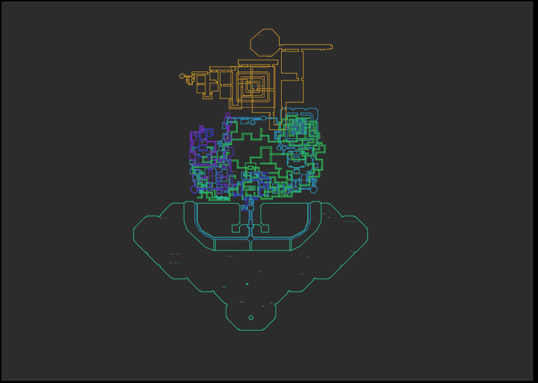
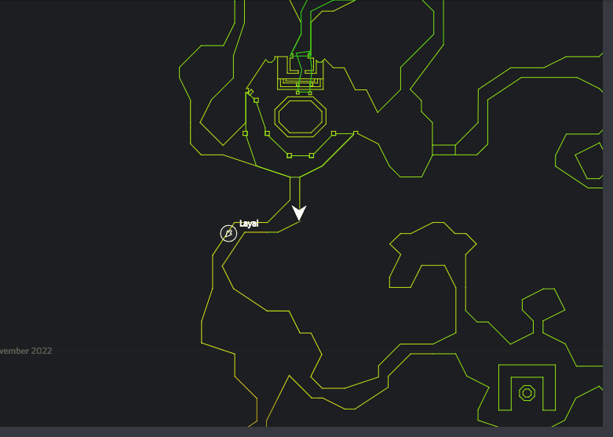
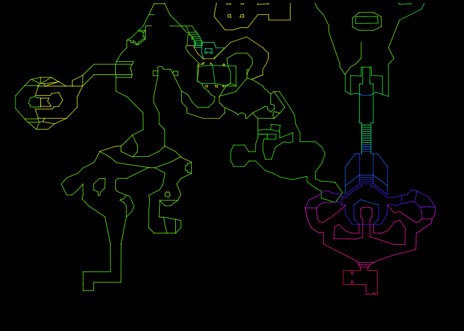

# JavaFX based map for [p1999-Everquest](https://www.project1999.com/)


### Installation

- install [Java](https://openjdk.org/) 
- download the [windows](https://github.com/mknblch/kasimaps/tree/develop/dist/Kasimaps.jar) or [linux](https://github.com/mknblch/kasimaps/tree/develop/dist/Kasimaps_lnx.jar) version
- run using `java -jar Kasimaps.jar` or create a clickable file like `start.bat` with:
    ```  
    @echo off
    java -jar Kasimaps.jar
    ```

- **_config.json_ from previous versions must be removed or the app won't start!**

### Features

- on first start you will be asked for the Everquest root directory (not _/Logs_ !)
- the program monitors Everquests `/log` directory and reacts to `/location` & `/who` commands and zone change 
- this behaviour can be activated using in-game command `/log on` or set as default in the ini-file
- the current map can be switched using the menu
- on zone-change, login or `/who` the map should change automatically
- zone-data is taken from [nparse](https://github.com/nomns/nparse) <3 and [wiki](https://wiki.project1999.com) (*99)


#### Map explorer

- map can be dragged and zoomed using `mouse & mouse-wheel`
- `App -> Lock Window` brings the window to the top and disables window-dragging and resizing
- `App -> Reset` resets the EQ directory and restarts the log parser
- `Options -> Color -> Z-Color` enables X Axis based coloring
- `Options -> Filter Z-Axis` hides map data far above or below your current position 
- `CTRL + mouse-wheel` manually changes the Z-Position
- `right click` copies the current position to clipboard
- the position can be pasted directly into in-game chat (/say, /tell, /group, /ooc) 
- when the parser reads the position in chat it creates a single waypoint marker
- the `Find` menu lists all known POI on the current map
- Find-Markers can be individually removed using `left click` or completely removed using `right click` 

#### p99 Zone-Data

- Map data taken from P1999 Wiki 10/2022
- POIs have been grouped and merged by distance
- use `Options -> POI` to enable/disable each layer individually
- Since locations on wiki mostly miss the Z part the p99 POI data will be visible regardless of your current position

#### Multiplayer Map Synchronization

- `App -> Synchronization` activates Sync over IRC
- once connected the client will try to set the channel password
- people using the same encryption password share their positions among each other
- even without a password the whole communication is encrypted
- only location messages on the active map are processed and shown 

#### Screenshots







<a href="https://www.flaticon.com/free-icons/dragon" title="dragon icons">Dragon icons created by Icongeek26 - Flaticon</a>